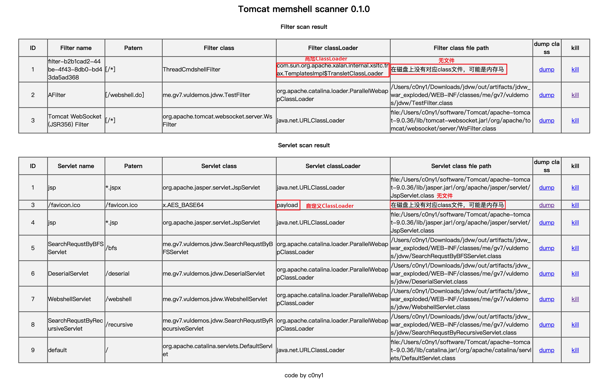
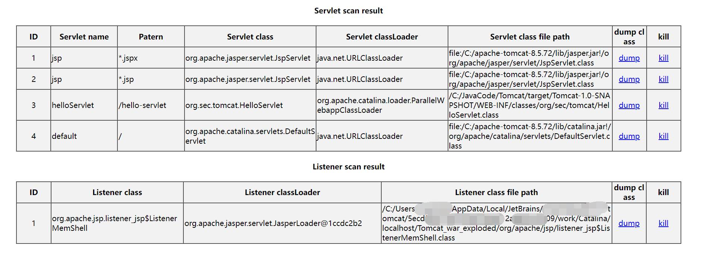

## 0x01 简介
通过jsp脚本扫描并查杀各类中间件内存马，比Java agent要温和一些。

## 0x02 截图

增加Listener型内存马检测，如果不存在Listener则不显示该项

## 0x03 更多
[Filter/Servlet型内存马的扫描抓捕与查杀](https://gv7.me/articles/2020/filter-servlet-type-memshell-scan-capture-and-kill/)

## 0x04 更新
添加Connector与Ws内存马检测逻辑与kill逻辑。

添加Jasper内存马检测逻辑与kill逻辑。

## 0x05 更新Spring内存马检测

